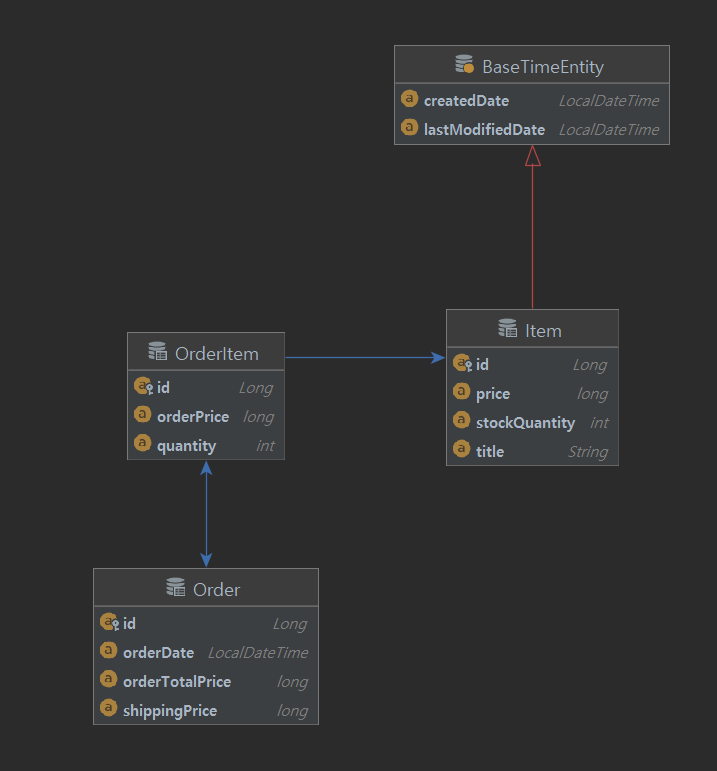

# 29CM 백앤드과제 서윤철

## Requirement
* 29CM 의 상품 주문 프로그램을 작성합니다.
* 상품은 고유의 상품번호와 상품명, 판매가격, 재고수량 정보를 가지고 있습니다.
* 한 번에 여러개의 상품을 같이 주문할 수 있어야 합니다.
* 상품번호, 주문수량은 반복적으로 입력 받을 수 있습니다.
  * 단, 한번 결제가 완료되고 다음 주문에선 이전 결제와 무관하게 주문이 가능해야 합니
  다.
* 주문은 상품번호, 수량을 입력받습니다.
* empty 입력 (space + ENTER) 이 되었을 경우 해당 건에 대한 주문이 완료되고, 결제하는 것으로 판단합니다.
* 결제 시 재고 확인을 하여야 하며 재고가 부족할 경우 결제를 시도하면 SoldOutException 이 발생되어야 합니다.
* 주문 금액이 5만원 미만인 경우 배송료 2,500원이 추가되어야 합니다.
* 주문이 완료되었을 경우 주문 내역과 주문 금액, 결제 금액 (배송비 포함) 을 화면에 display 합니다.
* 'q' 또는 'quit' 을 입력하면 프로그램이 종료되어야 합니다.
* Test 에서는 반드시 multi thread 요청으로 SoldOutException 이 정상 동작하는지 확인하는 단위테스트가 작성되어야 합니다.
* 상품의 데이터는 하단에 주어지는 데이터를 사용해주세요
  * 데이터를 불러오는 방식은 자유입니다.
  * 코드에 포함되어도 좋고, 파일을 불러도 되고, in memory db 를 사용하셔도 됩니다. 
  * 하지만 상품에 대한 상품번호, 상품명, 판매가격, 재고수량 데이터는 그대로 사용하셔 야 합니다.
  * 상품 데이터 csv 파일을 같이 제공합니다.
***  

## Enviroment
* Spring boot
* JPA
* H2
***

## Structure
### Table

### Entity

***

## API
### Item List
*URL
<pre>
  <code>
  GET /api/v1/items
  </code>
</pre>
*Reponse
* id: 상품 번호
* title: 상품명
* price: 가격
* stockQuantity: 재고수량
<pre>
  <code>
{
    "itemDtos": [
        {
            "id": 213341,
            "title": "20SS 오픈 카라/투 버튼 피케 티셔츠 (6color)",
            "price": 33250,
            "stockQuantity": 99
        },
        {
            "id": 377169,
            "title": "[29Edition.]_[스페셜구성] 뉴코튼베이직 브라렛 세트 (브라1+팬티2)",
            "price": 24900,
            "stockQuantity": 60
        },
        ...
    ]
}
  </code>
</pre>
***

### Order
*URL
<pre>
  <code>
  POST /api/v1/order
  </code>
</pre>
*Request
* id: 상품번호
* quantity: 주문수량
<pre>
  <code>
{
   "itemQuantityDtos": [
       {
        "id": 213341,
        "quantity": 1
       },
       {
        "id": 377169,
        "quantity": 2
       }
   ]
}
  </code>
</pre>

*Response
* orderTotalPrice: 주문 총 가격
* shippingPrice: 배송비
* title: 상품명
* quantity: 주문수량
<pre>
  <code>
{
    "orderTotalPrice":83050,
    "shippingPrice":0,
    "orderItemDtos":[
        {
            "title":"20SS 오픈 카라/투 버튼 피케 티셔츠 (6color)",
            "quantity":1
        },
        {
            "title":"[29Edition.]_[스페셜구성] 뉴코튼베이직 브라렛 세트 (브라1+팬티2)",
            "quantity":2
        }
    ]
}
  </code>
</pre>
