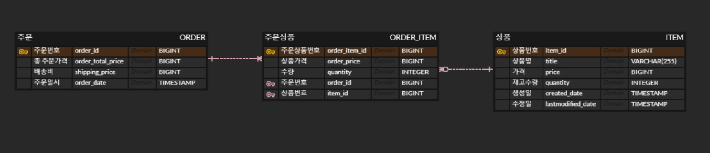

# 29CM 백앤드과제 서윤철

## Enviroment
* Spring boot
* JPA
* H2
***
## Structure

***
## API
### Item List
*URL
<pre>
  <code>
  GET /api/v1/items
  </code>
</pre>
*Reponse
* id: 상품 번호
* title: 상품명
* price: 가격
* stockQuantity: 재고수량
<pre>
  <code>
{
    "itemDtos": [
        {
            "id": 213341,
            "title": "20SS 오픈 카라/투 버튼 피케 티셔츠 (6color)",
            "price": 33250,
            "stockQuantity": 99
        },
        {
            "id": 377169,
            "title": "[29Edition.]_[스페셜구성] 뉴코튼베이직 브라렛 세트 (브라1+팬티2)",
            "price": 24900,
            "stockQuantity": 60
        },
        ...
    ]
}
  </code>
</pre>
***

### Order
*URL
<pre>
  <code>
  POST /api/v1/order
  </code>
</pre>
*Request
* id: 상품번호
* quantity: 주문수량
<pre>
  <code>
{
   "itemQuantityDtos": [
       {
        "id": 213341,
        "quantity": 1
       },
       {
        "id": 377169,
        "quantity": 2
       }
   ]
}
  </code>
</pre>

*Response
* orderTotalPrice: 주문 총 가격
* shippingPrice: 배송비
* title: 상품명
* quantity: 주문수량
<pre>
  <code>
{
    "orderTotalPrice":83050,
    "shippingPrice":0,
    "orderItemDtos":[
        {
            "title":"20SS 오픈 카라/투 버튼 피케 티셔츠 (6color)",
            "quantity":1
        },
        {
            "title":"[29Edition.]_[스페셜구성] 뉴코튼베이직 브라렛 세트 (브라1+팬티2)",
            "quantity":2
        }
    ]
}
  </code>
</pre>
